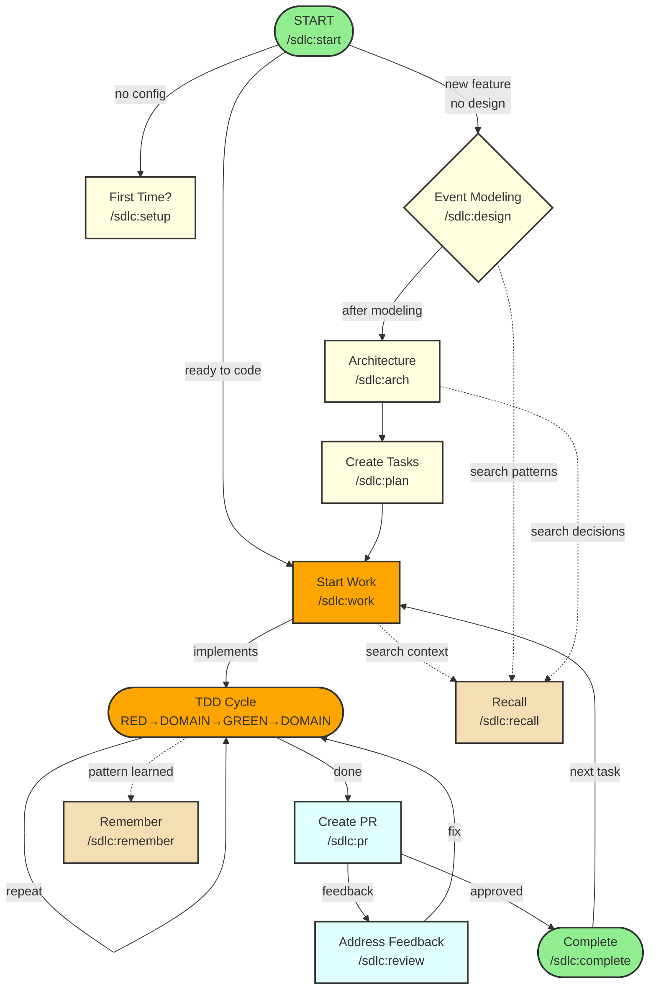

```mermaid
graph TB
    %% Entry points
    start([START<br/>/sdlc:start]):::entry
    setup[First Time?<br/>/sdlc:setup]:::planning

    %% Planning phase
    design{Event Modeling<br/>/sdlc:design}:::planning
    arch[Architecture<br/>/sdlc:arch]:::planning
    plan[Create Tasks<br/>/sdlc:plan]:::planning

    %% Implementation phase
    work[Start Work<br/>/sdlc:work]:::implementation
    tdd([TDD Cycle<br/>RED→DOMAIN→GREEN→DOMAIN]):::implementation

    %% Review phase
    pr[Create PR<br/>/sdlc:pr]:::review
    review[Address Feedback<br/>/sdlc:review]:::review
    complete([Complete<br/>/sdlc:complete]):::entry

    %% Memory commands
    recall[Recall<br/>/sdlc:recall]:::memory
    remember[Remember<br/>/sdlc:remember]:::memory

    %% Workflow edges
    start -->|no config| setup
    start -->|new feature<br/>no design| design
    start -->|ready to code| work

    design -->|after modeling| arch
    arch --> plan
    plan --> work

    work -->|implements| tdd
    tdd -->|repeat| tdd
    tdd -->|done| pr

    pr -->|feedback| review
    pr -->|approved| complete
    review -->|fix| tdd

    complete -->|next task| work

    %% Memory integration (dashed)
    tdd -.->|pattern learned| remember
    work -.->|search context| recall
    design -.->|search patterns| recall
    arch -.->|search decisions| recall

    %% Styling
    classDef entry fill:#90EE90,stroke:#333,stroke-width:2px
    classDef planning fill:#FFFFE0,stroke:#333,stroke-width:2px
    classDef implementation fill:#FFA500,stroke:#333,stroke-width:2px
    classDef review fill:#E0FFFF,stroke:#333,stroke-width:2px
    classDef memory fill:#F5DEB3,stroke:#333,stroke-width:2px
```
